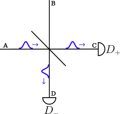
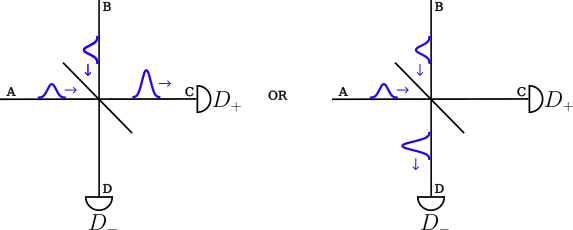

# [Detection and Projections](@id BStutorial)
A beamsplitter is a partly reflective, partly transmissive mirror that splits up an incoming photon, as depicted here. 



Assuming that the beamsplitter is equal (50% transmission and 50% reflection) and that we have only a single photon in one of waveguides impinging on the beamsplitter, the photon will go to detector plus 50% of the time and detector minus the other 50% of the time. This can be modeled in `WaveguideQED.jl` using [`LazyTensorKet`](@ref) and [`Detector`](@ref). We start by creating the two input waveguides.   


## Background Theory
Two photons impinging on a beamsplitter is a classic example of destructive and constructive interference. If the two photons are indistinguishable, they will always appear in pairs on the other side of the beamsplitter. That is the following scenario:  



However, what happens if the two photons have a slight mismatch in frequency or their temporal distribution, and how do we model this? Assuming the beamsplitter is 50/50 the beamsplitter transformation is[^1]  : $w_a \rightarrow (w_c + w_d)/\sqrt(2)$ and $w_b \rightarrow (w_c - w_d)/\sqrt(2)$, where $w_k$ is the annihilation operator for waveguide $k=\{a,b,c,d\}$. A one photon continuous fockstate in waveguide a and b with wavefunction $\xi_a(t)$ and $\xi_b(t)$ has the combined state:

$$\begin{align*}
\ket{\psi}_{a,b} &= \ket{\psi}_a \otimes \ket{\psi}_b =  \int_{t_0}^{t_{end}} \mathrm{d}t \ \xi_a(t) w_a^\dagger(t) \ket{0}_a \otimes \int_{t_0}^{t_{end}} \mathrm{d}t \ \xi_b(t) w_b^\dagger(t) \ket{0}_b \\
& \int_{t_0}^{t_{end}} \mathrm{d}t \int_{t_0}^{t_{end}} \mathrm{d}t' \xi_a(t)\xi_b(t') w_a^\dagger(t)  w_b^\dagger(t') \ket{0}_a\ket{0}_b
\end{align*}$$

Using the beamsplitter transformation, we thus have the following state after the two photons have interfered with the beamsplitter:

$$\begin{align*}
\ket{\psi}_{a,b} &\xrightarrow[]{BS} \frac{1}{2}  \int_{t_0}^{t_{end}} \mathrm{d}t \int_{t_0}^{t_{end}} \mathrm{d}t' \xi_a(t)\xi_b(t') (w_c^\dagger(t) + w_d^\dagger(t))  (w_c^\dagger(t') - w_d^\dagger(t')) \ket{0}_a\ket{0}_b \\
&=  \frac{1}{2}  \int_{t_0}^{t_{end}} \mathrm{d}t \int_{t_0}^{t_{end}} \mathrm{d}t' \xi_a(t)\xi_b(t') \left [ w_c^\dagger(t) w_c^\dagger(t') + w_d^\dagger(t)w_c^\dagger(t') - w_c^\dagger(t)w_d^\dagger(t') - w_d^\dagger(t)w_d^\dagger(t') \right ] \ket{0}_c\ket{0}_d \\
&= \frac{1}{2} \left ( W_c^\dagger(\xi_a) W_c^\dagger(\xi_b) \ket{0}_c - W_d^\dagger(\xi_a) W_d^\dagger(\xi_b) \ket{0}_d + \int_{t_0}^{t_{end}} \mathrm{d}t \int_{t_0}^{t_{end}} \mathrm{d}t' \left [ \xi_a(t)\xi_b(t') - \xi_a(t')\xi_b(t) \right] \ket{1}_c\ket{1}_d \right)
\end{align*}$$

where we introduced $$W_{c/d}^\dagger(\xi_a) W_{c/d}^\dagger(\xi_b) \ket{0}_{c/d} = int_{t_0}^{t_{end}} \mathrm{d}t \int_{t_0}^{t_{end}} \mathrm{d}t' \xi_a(t)\xi_b(t') w_{c/d}^\dagger(t) w_{c/d}^\dagger(t') \ket{0}_{c/d}$$. $$W_{c/d}^\dagger(\xi_a) W_{c/d}^\dagger(\xi_b) \ket{0}_{c/d}$$ thus corresponds to both photons going into the same direction. It is also evident that if $$\xi_a(t)\xi_b(t') - \xi_a(t')\xi_b(t) \right = 0$$ then we will have no photons in waveguide c and d simultaneously. This condition is exactly fulfilled if the photon in waveguide a is indistinguishable from the photon in waveguide b. This also means that if the photons ARE distinguishable, we will start to see photon occurring in waveguide c and d simultaneously. All this and more can be simulated in the code, and in the next section, we walk through how to set the above example up in the code.

## Beamsplitter and detection in WaveguideQED.jl

In `WaveguideQED.jl` we create the two incoming photons in each of their respective waveguides and define the corresponding annihilation operators:

```@example detection
using WaveguideQED #hide
using QuantumOptics #hide
times = 0:0.1:20
bw = WaveguideBasis(1,times)
ξfun(t,σ,t0) = complex(sqrt(2/σ)* (log(2)/pi)^(1/4)*exp(-2*log(2)*(t-t0)^2/σ^2))
waveguide_a = onephoton(bw,ξfun,1,10)
waveguide_b = onephoton(bw,ξfun,1,10)
wa = destroy(bw)
wb = destroy(bw)
nothing #hide
``` 

We then combine the states of waveguide a and b in a lazy tensor structure (tensor product is never calculated, but the dimensions are inferred in subsequent calculations):

```@example detection
ψ_total = LazyTensorKet(waveguide_a,waveguide_b)
nothing #hide
``` 

Now we define [`Detector`](@ref) operators, which define the beamsplitter and subsequent detection operation. In the following $\mathrm{Dplus} = D_+ = \frac{1}{\sqrt{2}}(w_a + w_b) $ and $\mathrm{Dminus} = D_- = \frac{1}{\sqrt{2}}(w_a - w_b)$

```@example detection
Dplus = Detector(wa/sqrt(2),wb/sqrt(2))
Dminus = Detector(wa/sqrt(2),-wb/sqrt(2))
nothing #hide
``` 

The [`Detector`](@ref) applies the first operator (`wa/sqrt(2)`) to the first `Ket` in LazyTensorKet (`waveguide_a`) and the second operator (L`$\pm$ wb/sqrt(2)`) to the second `Ket` in `LazyTensorKet` (waveguide_b). The probability of detecting a photon in the detectors can then be calculated by:

```@repl detection
p_plus = Dplus * ψ_total
p_minus = Dminus * ψ_total
```

The returned probabilities are zero because there is no states that result in only ONE click at the detectors. Instead, we have to ask for the probability of detecting TWO photons:

```@repl detection
p_plus_plus = Dplus * Dplus * ψ_total
p_minus_minus = Dminus * Dminus * ψ_total
```

Notice that we here asked what the probability of having a detection event in detector plus/minus and, subsequently, another detection event in detector plus/minus is. The output was $50\%$ for both cases reflecting the above calculations where we would expect the two photons always come in pairs. As a consequence, the probability of having a click in detector plus and then in detector minus (or vice versa) is given as:

```@repl detection
p_plus_minus = Dplus * Dminus * ψ_total
p_minus_plus = Dminus * Dplus * ψ_total
```

As expected, the resulting probabilities are zero. If we instead displace the photons in time so that one is centered around $t = 5$ and another around $t = 15$ we get:

```@repl detection
waveguide_a = onephoton(bw,ξfun,1,5);
waveguide_b = onephoton(bw,ξfun,1,15);
ψ_total = LazyTensorKet(waveguide_a,waveguide_b);
p_plus_plus = Dplus * Dplus * ψ_total
p_minus_minus = Dminus * Dminus * ψ_total
p_plus_minus = Dplus * Dminus * ψ_total
p_minus_plus = Dminus * Dplus * ψ_total
```

Thus we have an equal probability of detection events in the same detector and opposite detectors since the two photon-pulses are temporarily separated.


[^1]: [Gerry2004](@cite)
