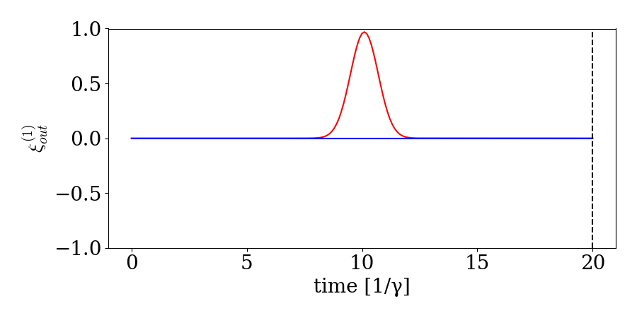

# WaveguideQED.jl

WaveguideQED.jl is a package for simulating continuous fockstates in waveguides. It expands on [`QuantumOptics.jl`](https://qojulia.org/) by adding a custom basis, operators, and routines for doing detection. 

## Suggested readings

The following is a list of relevant papers that provide background to the numerical method implemented in the repository. 
* Heuck, M., Jacobs, K.,&; Englund, D. R. (2020). Photon-photon interactions in dynamically coupled cavities. *Physical Review A*, *101*(4). https://doi.org/10.1103/PhysRevA.101.042322
* Heuck, M., Jacobs, K., &; Englund, D. R. (2020). Controlled-Phase Gate Using Dynamically Coupled Cavities and Optical Nonlinearities. *Physical Review Letters*, *124*(16). https://doi.org/10.1103/PhysRevLett.124.160501
* Krastanov, S., Jacobs, K., Gilbert, G., Englund, D. R., &; Heuck, M. (2022). Controlled-phase gate by dynamic coupling of photons to a two-level emitter. *Npj Quantum Information*, *8*(1), 103. https://doi.org/10.1038/s41534-022-00604-5

The following papers attack similar types of problems that can be solved with `WaveguideQED.jl` and serve as additional context. 
* Kiilerich, A. H., &; Mølmer, K. (2019). Input-Output Theory with Quantum Pulses. *Physical Review Letters*, *123*(12), 123604. https://doi.org/10.1103/PhysRevLett.123.123604
* Kiilerich, A. H., &; Mølmer, K. (2020). Quantum interactions with pulses of radiation. *Physical Review A*, *102*(2), 023717. https://doi.org/10.1103/PhysRevA.102.023717
* Arranz Regidor, S., Crowder, G., Carmichael, H., &; Hughes, S. (2021). Modeling quantum light-matter interactions in waveguide QED with retardation, nonlinear interactions, and a time-delayed feedback: Matrix product states versus a space-discretized waveguide model. *Physical Review Research*, *3*(2). https://doi.org/10.1103/PhysRevResearch.3.023030


## Dev docs
Added functionalities:
* [`WaveguideBasis`](@ref) for representing the waveguide space and the related generator functions: [`zerophoton`](@ref), [`onephoton`](@ref), and [`twophoton`](@ref). Also see [`OnePhotonView`](@ref), [`TwoPhotonView`](@ref), and [`plot_twophoton!`](@ref) for viewing the waveguide data for plotting. Note that [`WaveguideBasis`](@ref) can contain multiple waveguides.
* [`WaveguideOperator`](@ref) which are specialized operators allowing efficient annihilation and creation operators at each time-bin in the waveguide. They are created by giving a basis to [`WaveguideQED.destroy`](@ref) and [`WaveguideQED.create`](@ref)
* Since the interaction between the waveguide time-bin mode $k$ and cavity/emitter is given as: $a^\dagger w_k - a w_k^\dagger$ there are specially optimized functions for doing these operations called [`CavityWaveguideOperator`](@ref) which are created using a fockbasis and a waveguide basis and the functions [`emission`](@ref) and [`absorption`](@ref).
* [`Detector`](@ref), [`LazyTensorKet`](@ref), and [`LazySumKet`](@ref), together with [`detect_single_click`](@ref) and [`detect_double_click`](@ref) allow one to do a beamsplitter interference and subsequent detection of photons coming from two waveguides. 



```@meta
DocTestSetup = quote
    using WaveguideQED
end
```

