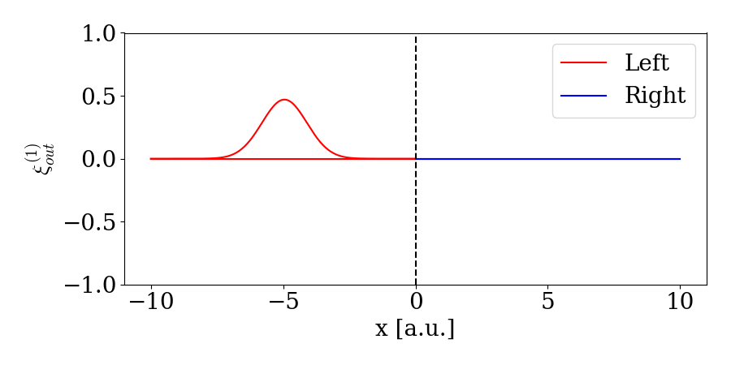

# Multiple waveguides

## [Two Waveguides](@id twowaveguide)
In the previous examples, we have only considered cases with a single waveguide. In this tutorial, we show how to model a beamsplitter and an optical switch using two waveguides. A beamsplitter or a swap gate can be modelled using the Hamiltonian $H_I = V(w_1^\dagger w_2 + w_2^\dagger w_1)$ where V is some interaction strength that determines which interaction is moddeled (we will discuss this in detail later). $w_1$ and $w_2$ is the annihilation operators of the two waveguides. A sketch of the system can be seen here:


 We can describe the state of two waveguides with a total of N excitations by adding an argument specifying the number of waveguides as:

```@example multiple
using WaveguideQED #hide
using QuantumOptics #hide
times = 0:0.1:10
dt = times[2] - times[1]
NPhotons = 2
NWaveguides = 2
bw = WaveguideBasis(NPhotons,NWaveguides,times)
nothing #hide
``` 

When creating operators, we now have to specify which waveguide they are acting on (in this case number one or two). This is done by an extra argument to [`create`](@ref) and [`destroy`](@ref):

```@example multiple
wd1 = create(bw,1)
w1 = destroy(bw,1)
wd2 = create(bw,2) 
w2 = destroy(bw,2)
nothing #hide
``` 

Similarly, initializing one or two photon states in the first or second waveguide is done by:

```@example multiple
ξ(t,σ,t0) = sqrt(2/σ)* (log(2)/pi)^(1/4)*exp(-2*log(2)*(t-t0)^2/σ^2)
ξ2(t1,t2,σ,t0) = ξ(t1,σ,t0)*ξ(t2,σ,t0)
ψ_single_1 = onephoton(bw,1,ξ,times,2,5)
ψ_double_1 = twophoton(bw,1,ξ2,times,2,5)
ψ_single_2 = onephoton(bw,2,ξ,times,2,5)
ψ_double_2 = twophoton(bw,2,ξ2,times,2,5)
nothing #hide
``` 

If we want to describe a simultanous excitation in both waveguides (states like $\ket{1_i}_\mathrm{1}\ket{1_j }_\mathrm{2}$ where the subscript $$\ket{1_i}_\mathrm{i}$ means waveguide i) we specify both indeces of the waveguides:

```@example multiple
ψ_single_1_and_2 = twophoton(bw,[1,2],ξ2,times,2,5)
nothing #hide
``` 

## Beamsplitter
Let's now treat the same example as in [Interference on Beamsplitter](@ref BStutorial). We consider the two waveguides in a identic single photon state and thus use the above defined `ψ_single_1_and_2`. The Hamiltonian governing a beamsplitter in the time binned formalism has $V= \pi/4$:

```@example multiple
V = pi/4
H = im*V/dt*(wd2*w1 - wd1*w2)
nothing #hide
``` 

We can then evolve the system under this Hamiltonian to perform the beamsplitting operation:

```@example multiple
psi_out = waveguide_evolution(times,ψ_single_1_and_2,H)

nothing #hide
``` 

We can then view the final state to verify that we only have twophotons in the same waveguide simultanouesly:

```@repl multiple
psi_second = TwoPhotonView(psi_out,2);
psi_first = TwoPhotonView(psi_out,1);
psi_first_second = TwoPhotonView(psi_out,[1,2]);
norm(psi_second)^2
norm(psi_first)^2
norm(psi_first_second)^2
``` 

Except for numerical errors we thus have 50% chance of observing both photons in the same waveguide and 0 (8.736388404016349e-9)% of observing both photons in each of the waveguide simultanoues. 


Similarly, we can plot the scattering / splitting of a single photon arriving in the left arm. 




## Swap
If we instead choose $V = \pi / 2$ we get the SWAP operation. Let us consider one photon in the first waveguide and swap it to second waveguide and animate the evolution:

```@example multiple
V = pi/2
H = im*V/dt*(wd2*w1 - wd1*w2)
psi_out_swap = waveguide_evolution(times,ψ_single_1,H)
first_after = OnePhotonView(psi_out_swap,1)
second_after = OnePhotonView(psi_out_swap,2)
nothing #hide
``` 


!!! info "WaveguideBasis(2,2,times) vs. Waveguide $\otimes$ Waveguide"
    Instead of using the custom basis for handling two waveguides, one could instead just do a tensor product between two waveguides basises. This naive approach would look something like:
    
    ```
    times = 0:0.1:10
    bw = WaveguideBasis(2,times)
    Btotal = bw ⊗ bw
    nothing #hide
    ``` 

    This might work if you only consider single photon excitations in the waveguides, but if you go consider two photon excitations (as in the above) the hilbert space blows up. Indeed, in the above example, the hilbert space is of size: 27.594.009!!! However, since we often know that the system in total only has two excitations, there is no possibility of having two photons in both waveguides simultanously (states of type: $\ket{1_k,1_j}_{1}\ket{1_l,1_m}_{2}$). This part of the Hilber space takes up the majority since it scales as $\propto N^4$ where N is the number of timebins. Instead we can exploit that only a total of two excitations is present simultanosly in the system. For this we use the custom basis [`WaveguideBasis`](@ref) with an addination input stating the number of waveguides:

    ```@example multiple
    bw = WaveguideBasis(2,2,times)
    nothing #hide
    ``` 

    The hilbert space is now of size: 20706, this is of course still large Hilbert space, but 3 orders of magnitude smaller than the naive approach as it still only scales as $\propto N^2$. 

