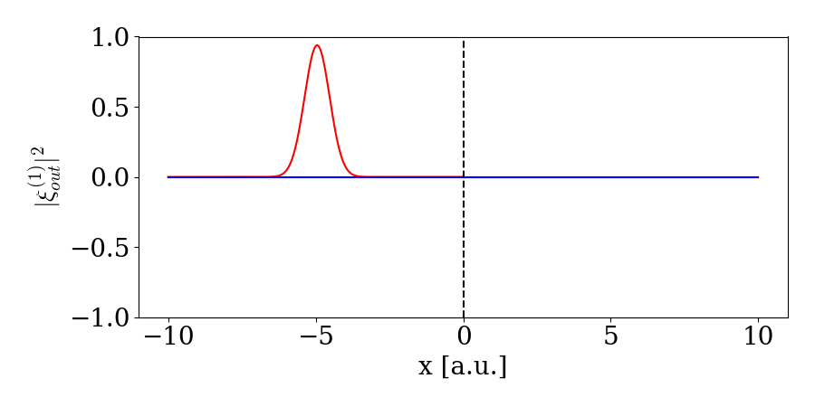

# [Multiple Waveguides](@id multiple)

In the [tutorial](@ref tutorial), we considered one waveguide containing one or two waveguides. In **WaveguideQED**, we can also consider problems where we have multiple waveguides or equivalently multiple waveguide modes. We can create a waveguide basis containing two photons and two waveguides with:


```@example multiple
using WaveguideQED #hide
using QuantumOptics #hide
times = 0:0.1:10
dt = times[2] - times[1]
NPhotons = 2
NWaveguides = 2
bw = WaveguideBasis(NPhotons,NWaveguides,times)
nothing #hide
``` 


!!! info "WaveguideBasis(2,2,times) vs. Waveguide $\otimes$ Waveguide"
    Instead of using the custom basis for handling two waveguides, one could instead just do a tensor product between two waveguides basis. This naive approach would look something like:
    
    ```@repl multiple
    times = 0:0.1:10
    bw = WaveguideBasis(2,times)
    Btotal = bw ⊗ bw
    ``` 

    However, in the above example, the Hilbert space is of size: 27.594.009!!! What happened? We are now storing waveguide states of the type $\ket{1_k,1_j}_{1}\ket{1_l,1_m}_{2}$, that is two photons in each waveguide. But we wanted to only store up to two excitations and thus there is no possibility of having these states. Instead, we can exploit that only a total of two excitations are present simultaneously in the system. For this, we use the custom basis [`WaveguideBasis`](@ref) with an additional input stating the number of waveguides:

    ```@repl multiple
    bw = WaveguideBasis(2,2,times)
    ``` 

    The Hilbert space is now of size: 20706. This is still a large Hilbert space, but it is three orders of magnitude smaller than the naive approach as it only scales as $\propto N^2$ as compared to $\propto N^4$ where $\N$ is the number of time-bins.. 


We can then create the annihilation and creation operators for each waveguide by providing an index to [`destroy`](@ref) and [`create`](@ref).

```@example multiple
wd1 = create(bw,1)
w1 = destroy(bw,1)
wd2 = create(bw,2) 
w2 = destroy(bw,2)
nothing #hide
``` 

Here `wd1` creates a photon in waveguide mode $1$: $w_{k,1}^\dagger \ket{\emptyset}_1 \ket{\emptyset}_2 = \ket{1_k}_1 \ket{\emptyset}_2$, and equivalently `wd2`: $w_{k,2}^\dagger \ket{\emptyset}_1 \ket{\emptyset}_2 = \ket{\emptyset}_1 \ket{1_k}_2$. $\ket{1_k}_i$ here denotes an excitation in time-bin $k$ in waveguide $i$.   

Similarly, if we want to create a one-photon state in waveguide 1 or 2 we give [`onephoton`](@ref) an extra waveguide index:

```@example multiple
ξ(t,σ,t0) = sqrt(2/σ)* (log(2)/pi)^(1/4)*exp(-2*log(2)*(t-t0)^2/σ^2)
w_idx = 1
ψ_single_1 = onephoton(bw,w_idx,ξ,2,5)

w_idx = 2
ψ_single_2 = onephoton(bw,w_idx,ξ,2,5)
nothing #hide
```

where `ψ_single_1` here denotes the state: $\ket{\psi}_1 = \sum_k \sqrt{\Delta t} \xi(t_k) w_{k,1}^\dagger \ket{\emptyset}  \otimes \ket{\emptyset}$ and `ψ_single_2` equivalently $\ket{\psi}_2 = \ket{\emptyset} \otimes \sum_k \sqrt{\Delta t} \xi(t_k) w_{k,2}^\dagger \ket{\emptyset}$. We can also define two-photons states with:

```@example multiple
ξ2(t1,t2,σ,t0) = ξ(t1,σ,t0)*ξ(t2,σ,t0)
w_idx = 1
ψ_double_1 = twophoton(bw,w_idx,ξ2,2,5)/sqrt(2)

w_idx = 2
ψ_double_2 = twophoton(bw,w_idx,ξ2,2,5)/sqrt(2)
nothing #hide
```

We can even describe a simultaneous excitation in both waveguide states like $\ket{1_i}_1\ket{1_j }_2$ by providing two indices:

```@example multiple
ψ_single_1_and_2 = twophoton(bw,[1,2],ξ2,2,5)
nothing #hide
``` 

Note the absence of $$1/\sqrt{2}$$ when defining a state with one photon in each waveguide. 

## [Scattering on two-level system](@id lodahl)

As an example of a system with multiple waveguide modes, we consider a two-level system coupled with two directional waveguide modes; a left and a right propagating mode. A sketch of the system can be seen below here:


Such a system is also considered experimentally in [Le Jeannic, et al. Nat. Phys. 18, 1191–1195 (2022)](https://www.nature.com/articles/s41567-022-01720-x) and we here reproduce the theoretical results shown in the paper. The emitter here couples equally to the two waveguide modes with a total rate of $\gamma$, the Hamiltonian is here: 

$$H = i \sqrt{\gamma/2/\Delta t} ( a^\dagger w_1 - a w_1^\dagger) + i \sqrt{\gamma/2/\Delta t} ( a^\dagger w_2 - a w_2^\dagger)$$

We can define this Hamiltonian, by creating the basis of the emitter and combining it with the waveguide operators:

```@example multiple
be = FockBasis(1)
a = destroy(be)
ad = create(be)
γ = 1
H = im*sqrt(γ/2/dt)*( ad ⊗ w1 - a ⊗ wd1  ) + im*sqrt(γ/2/dt)*( ad ⊗ w2 - a ⊗ wd2  )
nothing #hide
```

In the above, we denote waveguide $1$ as the right propagating mode and waveguide $2$ as the left propagating mode.

We can now study how single or two-photon states scatter on the emitter. We define the initial one-photon or two-photon Gaussian state and solve it using the defined Hamiltonian:

```@example multiple
ξ₁(t1,σ,t0) = sqrt(2/σ)* (log(2)/pi)^(1/4)*exp(-2*log(2)*(t1-t0)^2/σ^2)
ξ₂(t1,t2,σ,t0) = ξ₁(t1,σ,t0) * ξ₁(t2,σ,t0) 
w = 1
t0 = 5
ψ1 = fockstate(be,0) ⊗ onephoton(bw,1,ξ₁,w,t0)
ψ2 = fockstate(be,0) ⊗ twophoton(bw,1,ξ₂,w,t0)/sqrt(2)
ψScat1 = waveguide_evolution(times,ψ1,H)
ψScat2 = waveguide_evolution(times,ψ2,H)
nothing #hide
```

Viewing the scattered states is then done using TwoPhotonView and the index for the corresponding waveguide. Giving two indices returns the combined single photon state in both waveguides $\sum_{j,k} \ket{1_j}_1 \ket{1_k}_2$:

```@example multiple
ψ2RightScat = TwoPhotonView(ψScat2,1,[1,:])
ψ2LeftScat = TwoPhotonView(ψScat2,2,[1,:])
ψ2LeftRightScat = TwoPhotonView(ψScat2,2,1,[1,:])
nothing #hide
```

We now want to compare the difference between a two-photon state scattering on the emitter and a single-photon state scattering. The scattered two-photon wavefunction can be expressed as $\xi^{(2)}(t_1,t_2) = \xi^{(1)}(t_1)\xi^{(1)}(t_2) + N(t_1,t_2)$, where $\xi^{(1)}(t)$ is the scattered single-photon state and $N(t_1,t_2)$ is the bound-state or non-linear contribution of the interaction with the emitter (stimulated emission). Thus, we compare the scattered two-photon state with the product of the scattered single-photon state. We thus calculate the two-time scattered distribution as:

```@example multiple
ψ1RightScat = zeros(ComplexF64,(length(times),length(times)))
ψ1LeftScat = zeros(ComplexF64,(length(times),length(times)))
ψ1LeftRightScat = zeros(ComplexF64,(length(times),length(times)))
ψ1Right = OnePhotonView(ψScat1,1,[1,:])
ψ1Left = OnePhotonView(ψScat1,2,[1,:])

for i in eachindex(times)
    for j in eachindex(times)
        ψ1RightScat[i,j] = ψ1Right[i]*ψ1Right[j]
        ψ1LeftScat[i,j] = ψ1Left[i]*ψ1Left[j]
        ψ1LeftRightScat[i,j] = ψ1Left[i]*ψ1Right[j]
    end
end
nothing #hide
```

Finally, we can plot the scattered wavefunctions, and we note that this matches Fig. 3 in Ref.[^1]:

```@example multiple
using PyPlot; #hide
rcParams = PyPlot.PyDict(PyPlot.matplotlib."rcParams") #hide
rcParams["font.size"] = 20 #hide
rcParams["font.family"] = "serif" #hide
rcParams["mathtext.fontset"] ="cm" #hide
fig,axs = subplots(3,2,figsize=(6,9))
plot_list = [ψ2RightScat,ψ2LeftScat,ψ2LeftRightScat,ψ1RightScat,ψ1LeftScat,ψ1LeftRightScat]
for (i,ax) in enumerate(axs)
    plot_twophoton!(ax,plot_list[i],times)
end
axs[1].set_ylabel("\$C^{RR}\$ \n t2 [a.u]")
axs[2].set_ylabel("\$C^{LL}\$ \n t2 [a.u]")
axs[3].set_ylabel("\$C^{LR}\$ \n t2 [a.u]")
axs[3].set_xlabel("t1 [a.u]")
axs[6].set_xlabel("t1 [a.u]")
plt.tight_layout()
plt.savefig("lodahl_fig3.svg") #hide
nothing #hide
```


If we consider the single photon state, we can also visualize the temporal evolution as:




[^1]: [DynamicalPhotonLodahl2022](@cite)